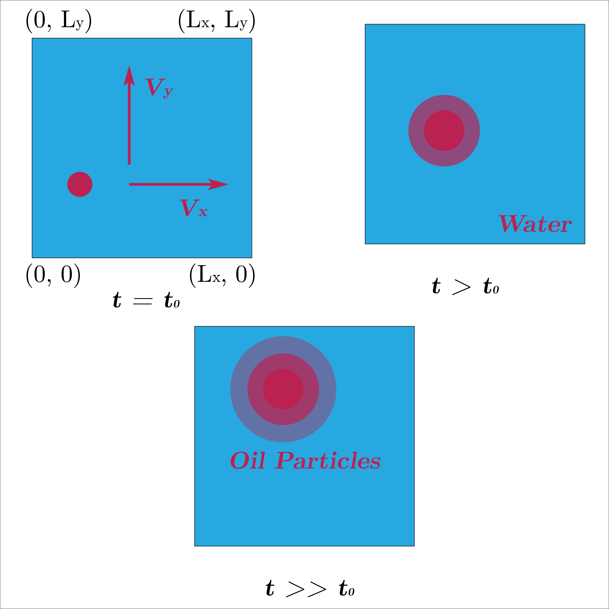

# Convection-Diffusion_Equation
Numerical Modelling of Oil Spillage over Water Surface Using Convection-Diffusion Equation done as a part of MA203: Numerical Methods Course during the first half of Sem I AY 2023-24 at Indian Institute of Technology Gandhinagar.

## **POSTER PRESENTATION**

## **The Motivation**
The idea for the analysis on the so-called "Convection-Diffusion Equation" *(Where its usually Advection that happens)*, popped out from a random internet search for topics to be taken up for numerical analysis.
I would consider it to be a feat that we could explore domains from Materials Science Engineering to Chemical Engineering. Understanding concepts like Control Volumes and Control Systems and how our naive high school analysis of such systems was backed up by such fundamental theorems like Reynold's Transport Theorem (RTT) that account for the realisation of any such scenario.

### The Diffusion
Although not needed for the project, we were able to explore the closeness of the Diffusion Equation to the Heat Equation and how these macro-level phenomenons had been derived from the Stochastic Processes as derived from Einstein's idea of Brownian Motion. It was all indeed fascinating to have things relate so well. Much apart from the numerical analysis was the deivation for the analytical solution, which although we haven't written about but was explored in interest. Few of the videos to do check out!:
* [Diffution Equation and Derivation from Brownian Motion](https://youtu.be/P9qar8mv3Tk?si=d6Iw0UHXtAA43_d-)
* [Analytical Soultion to Convection-Diffusion Equation](https://youtu.be/IFmSeI28daY?si=YK_S9YyUkNMRMkEa)
* [Behavior of Convection-Diffusion Equation](https://youtu.be/JhmKt1-zjIE?si=7jkZ1N_d_LXFMh8C)
* [Reynold's Transport Theorem - Part I](https://youtu.be/3HMq1O0xI_4?si=_kGCSt2AXMQDqMqu)
* [Reynold's Transport Theorem - Part II](https://youtu.be/PDq9YQh650g?si=XUyaRpIccJh7_caA)

## The Infamous Advection Part and the Boundary Conditions!
We were always doubtful regarding the boundary conditions for our system -> Dirichlet or Neumann?! We went ahead with the one that was easier to implement: the Dirichlet one with setting the boundary points always to have zero concentration *(which we realized much later that it did not represent the real scenario :( )*. And also, the velocity field part, having not being talked about anywhere, was still incomplete due to the fact that that the direction of velocity vector at each point dictates the Numerical Method (Either Forward Difference or Backward Difference in Euler's Method)
